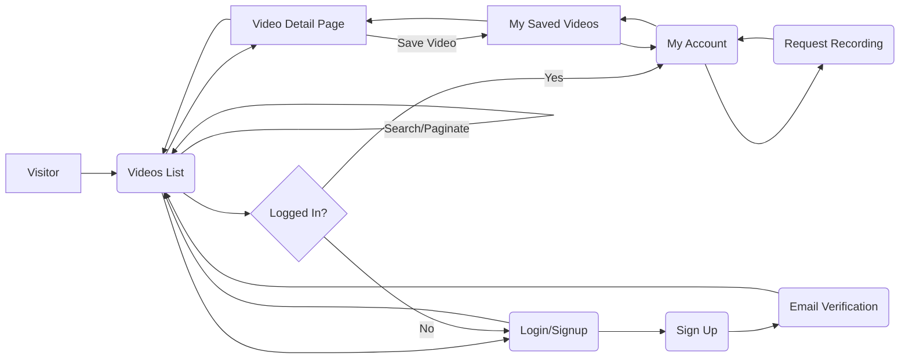
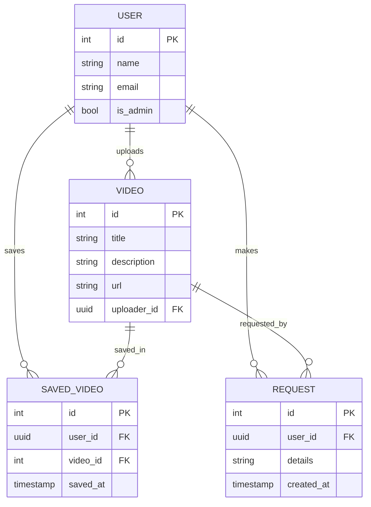

# Executive Summary  
We propose a modern Next.js 14 frontend that integrates with your existing Supabase backend to archive Chaturbate videos (à la recu.me/recubate).  This report identifies key questions and constraints, and then provides a comprehensive scaffold prompt and design.  We recommend using Next.js 14 (App Router) with TypeScript, Tailwind CSS, Radix/shadcn UI components, and the Supabase client for data and auth.  Core features include user authentication (email/password + OAuth), protected routes, user roles (e.g. admin vs user), video listing/detail pages with embedded players, “save video” bookmarks, a request-recording form with notifications, search/filter, and pagination.  Supabase Storage will host video files (using a Files bucket for CDN delivery) and Supabase Auth/RLS will secure data.  We detail a suggested file structure, major components, and Supabase API/edge-function interactions.  We also outline privacy and DMCA considerations (noting the need for takedown compliance), UI/UX wireframes with Mermaid diagrams (page flows and data model), and a stack comparison (Next.js vs Remix vs SvelteKit).  Throughout, we cite official docs for Supabase and Next.js to ensure best practices, and we summarize deployment/testing (e.g. GitHub + Vercel CI/CD, Playwright for E2E testing) strategies. 

## 1. Key Project Questions  
Before scoping the frontend, clarify the following requirements and constraints. Answering these will guide design and implementation:

- **Business Requirements & Legal/DMCA:**  
  - *Content Ownership & Licensing:* Are you authorized to archive and redistribute Chaturbate content? How will you handle copyright takedown requests under the DMCA? (A takedown policy and user agreement are typically required for user-uploaded or scraped video content.)  
  - *Privacy/Consent:* Do the videos involve adult performers? Ensure compliance with privacy laws (COPPA, if minors are involved — which Chaturbate disallows — and general privacy). Clarify if we must secure performer consent.  
  - *Terms of Service:* What does Chaturbate’s ToS say about scraping/archiving content? (You may need to avoid violating their API/ToS. Consult legal counsel or rely on fair use provisions.)  

- **Supabase Schema & Auth:**  
  - *Existing Tables:* What tables are in the current Supabase schema? (e.g. **users**, **videos**, **saved_videos**, **requests**, **profiles**, etc.) Provide table names, columns, and data types.  
  - *Auth Setup:* How are users authenticated? (e.g. Email/Password, Magic Link, OAuth providers like Google/Discord/Chaturbate API, etc.) Does the Supabase Auth table (auth.users) exist? Are there any additional profile tables?  
  - *User Roles:* What roles or permissions exist? (e.g. is there an “admin” or “moderator” flag on profiles? Do we need role-based access to certain pages or actions?)  
  - *RLS Policies:* Which Row-Level Security policies are in place? For example, is RLS enabled on each table? Common policies include: only allow row inserts/updates if `auth.uid() = user_id` for user-owned data; maybe only allow `admin` role to delete or moderate. Document any existing policies.  

- **Hosting & Deployment:**  
  - *Frontend Hosting:* Where will the site be deployed? (Vercel, Netlify, or self-hosted node server). If unspecified, assume Vercel for seamless Next.js integration.  
  - *Backend:* Supabase provides hosted Postgres & Storage; will any edge functions be used? Are you using Supabase’s Edge Functions or relying solely on client/server code and Next.js API routes?  
  - *CI/CD Pipeline:* Will you use GitHub/GitLab and set up GitHub Actions or Vercel’s built-in CI for testing and deployment?  

- **Authentication & Security:**  
  - *Auth Flows:* Confirm desired auth flows: sign-up (with email verification), login, password reset, OAuth (e.g. Google, Discord), and session handling. Supabase supports JWT and can handle email confirmations and password resets via its API.  
  - *Protected Routes:* Which pages should require login? (e.g. saving videos, requesting recordings, account settings).  
  - *Session Management:* Do we prefer client-side tokens or server-side session cookies? (Next.js + Supabase often uses Secure HTTP-only cookies for SSR compatibility.)  
  - *Token Handling:* Ensure refresh tokens are handled securely (Supabase has guidance on using cookies and the Supabase SSR helpers).  
  - *Row-Level Security:* Confirm that RLS policies are set up so each user can only see/edit their own saved items or requests, while possibly allowing public read of video metadata.  

- **Supabase Storage & Media:**  
  - *Buckets:* Is there a Supabase **Storage** bucket configured for videos? Usually a “files” bucket is created to store large media.  
  - *File Access:* Should videos be publicly accessible via CDN, or access-controlled? For public archiving, a public bucket (or a bucket with RLS policies) is common.  
  - *Uploads:* How do videos get into storage? (From a script or backend — not directly from this frontend.)  
  - *Video Encoding:* Are videos already encoded in a web-friendly format (MP4/HLS)? If not, we may need to integrate a processing pipeline (outside scope of UI) or embed an external player.  
  - *Rate Limits:* Consider Supabase and front-end rate limits. Supabase auth has [rate limits](https://supabase.com/docs/guides/auth#rate-limits), so implementing client-side debouncing (e.g. on search) and server-side pagination is important.  

- **UI/UX Preferences:**  
  - *Design Themes:* Any preferred design theme (light/dark mode, color palettes)? Accessibility standards (ARIA, keyboard nav) should be followed.  
  - *Component Libraries:* We plan TailwindCSS + Radix UI (headless accessible primitives) with [shadcn/ui](https://supabase.com/docs/guides/auth/quickstarts/nextjs) for ready-made styled components. Confirm if these choices are acceptable.  
  - *Language/Localization:* Will the UI need multi-language support or just English? Default to en-US if unspecified.  
  - *Responsive Design:* Ensure mobile-friendliness (stacked layouts, hamburger menu, etc.).  
  - *Accessibility:* Use semantic HTML and consider high-contrast and screen-reader compatibility.  

- **Feature-specific Questions:**  
  - *Pagination & Search:* Do we need cursor-based pagination for video lists? What search fields (title, tags, broadcaster name) and filters (category, date)?  
  - *Save Videos:* What happens when a user “saves” a video? (Likely insert a row linking userID ↔ videoID in a “saved_videos” table.)  
  - *Request Recording:* What fields does the request form need? E.g. broadcaster name, date/time or link, optional message. Should submission trigger an email or notification? (Could use Supabase Edge Function to send email on insert.)  
  - *Video Player:* Will we embed an HTML5 `<video>` using Supabase's public file URL? If using HLS, consider a library like video.js.  
  - *Admin Tools:* Is there an admin interface for managing videos or requests? (Not mentioned, but consider future needs.)  

## 2. Replit Scaffold Prompt  
Below is a **paste-ready prompt** for Replit (or any AI-assisted coding environment) to scaffold the frontend. It instructs creation of a Next.js 14 app with recommended libs and features. Copy and paste the entire prompt into Replit’s AI or CLI. Adjust specific details (like OAuth providers or Supabase URLs) as needed.  

```plaintext
Create a new Next.js 14 project (App Router, TypeScript) with Tailwind CSS, Radix UI, and shadcn/ui components. Integrate Supabase for Auth and Data: 
- Configure environment variables: NEXT_PUBLIC_SUPABASE_URL and NEXT_PUBLIC_SUPABASE_PUBLISHABLE_KEY. 
- Use '@supabase/supabase-js' and '@supabase/ssr' for client and server Supabase clients. 
- Set up the Supabase client in /lib/supabase.ts with separate createBrowserClient (for client components) and createServerClient (for server components and actions). 
- Implement user authentication flows: sign up (email/password with email confirmation), log in, logout, password reset, and email verification using Supabase Auth. Include OAuth providers (e.g. Google, Discord) in Supabase settings and in the frontend UI (e.g. a "Sign in with Google" button). 
- Add protected routes: pages under /app/account, /app/saved, /app/request should require login. Use Supabase Auth helpers (getSession/getUser) or Next.js middleware to redirect unauthenticated users to /login. 
- Create the following pages/routes: 
  - **/app/login/page.tsx:** A form with email and password fields and “Log in” and “Sign up” buttons. Use Next.js Server Actions to handle `login()` and `signup()` by calling Supabase Auth (similar to Supabase example). Show errors for invalid credentials. 
  - **/app/signup/page.tsx:** (or combined with login) form and handler for new account creation. Send email verification. 
  - **/app/reset-password/page.tsx:** Form to enter email to send password-reset link via `supabase.auth.resetPasswordForEmail()`. 
  - **/app/verify-email/page.tsx:** A page that reads a token from URL and calls `supabase.auth.verifyOtp()` or similar to confirm email. 
  - **/app/account/page.tsx:** User account dashboard (protected). Show user’s profile info (name/email), allow updating profile (e.g. display name), and change password. Also link to “Saved Videos” and “New Request” page. 
  - **/app/saved/page.tsx:** List of videos the user has saved. Fetch from Supabase (e.g. `select * from saved_videos join videos`). Allow removing saves. 
  - **/app/request/page.tsx:** Form to request a new video recording. Fields: link or broadcaster name, details. On submit, insert into a “requests” table and show a success notification. Optionally trigger an Edge Function or email (brief mention). 
  - **/app/videos/page.tsx:** Public video archive listing (Home page). Fetch videos from Supabase (with pagination). Include search bar and filters (e.g. by title, broadcaster). Implement server-side fetching (use Supabase client in server component) and pass data to client via props. 
  - **/app/videos/[id]/page.tsx:** Video detail page. Fetch one video by ID, display title/description, and embed a video player (e.g. HTML5 `<video src={supabase.storage.getPublicUrl(...)}>`). Show a “Save” button (if user is logged in) that inserts into “saved_videos”. 
  - **/app/admin/page.tsx** (optional): If an admin role exists, a page to manage pending requests or videos. Show how to check `is_admin` from Supabase user metadata and restrict access. 
  - **/app/layout.tsx:** A top-level layout with a header/nav (logo, links to Home, Saved, Request, Account or Login). Use Radix/shadcn UI for a responsive navbar and dark mode toggle. 
- **State Management:** Use React Query or SWR (or Supabase cache) to manage server data. For instance, use `useSWR` or React Query for fetching video lists and details. Ensure proper invalidation after mutations (e.g. refetch saved list after saving a video). 
- **Styling:** Use Tailwind CSS for layout. Use shadcn/ui components (Dialog, Input, Button, Form, etc.) which are built on Radix UI. Include global styles and configure dark mode. 
- **Routing & Navigation:** Use Next.js `Link` for client navigation. File-system routing as above. For modals (e.g. login/signup), consider using Next.js Modal routes or in-page dialogs. 
- **Supabase RLS & Security:** In Supabase, ensure RLS is enabled on tables. Implement policies such as `using (auth.uid() = videos.uploader_id)` or for saved items `using (auth.uid() = saved_videos.user_id)`. Only admin users can delete videos or view all requests. (Follow Supabase docs on RLS.) 
- **Data fetching:** Use Next.js Server Components (async functions in the app router) to call Supabase. For example, in `page.tsx` use `const supabase = createServerComponentClient()` and run `.from('videos').select(...)`. For mutations (saving video, requests), use Next.js Server Actions (`'use server'` functions) to call Supabase from the server. 
- **Pagination & Filtering:** Implement pagination by passing a `LIMIT` and `OFFSET` or use cursor-based pagination via Supabase (e.g. `gt id`). For searching, query Supabase with `ilike` or full-text search. Consider an index or the pg_trgm extension for fuzzy search. 
- **Notifications:** Use the `useToast` or similar component from shadcn/ui to show success/error toasts. For example, after signup or save, show a toast. 
- **Video Player:** Use the HTML5 `<video>` element or a lightweight React video player component. Ensure CORS allows streaming from your storage CDN. Optionally support HLS. 
- **Testing:** Include basic unit tests with Jest or Vitest for key components (e.g. form validation) and a Playwright setup for end-to-end tests.  
- **Deployment:** Assume deployment to Vercel. Ensure a `vercel.json` or `next.config.js` is configured if necessary. Use environment variables for Supabase. Set up a build step (`npm run build`, `npm run start`). 

```

The above prompt instructs Replit to generate a full Next.js + Supabase frontend with the specified tech stack and features. It covers auth flows, routing, data fetching, components, and security (using RLS and JWT from Supabase).

## 3. Frontend Architecture and Implementation  

### Technology Stack  
- **Framework:** **Next.js 14** (App Router) with React. The App Router is file-system–based and supports React Server Components, nested layouts, and Server Actions.  
- **Language:** TypeScript for type safety.  
- **Styling:** Tailwind CSS for utility-first styling, plus shadcn/ui (built on Radix UI primitives) for accessible, customizable components (Buttons, Forms, Dialogs, etc.).  
- **State/Data:** Use Supabase JS client for queries/mutations. Optionally use React Query or SWR for caching. Next.js Server Components will handle data fetching securely.  
- **Authentication:** Supabase Auth for user management (email/password, OAuth). Use Secure HTTP-only cookies via `@supabase/ssr` to maintain sessions.  
- **Video Hosting:** Supabase Storage (Files bucket) with CDN for fast delivery. Videos can be accessed by public URLs or via signed URLs if protected.  
- **Notifications:** shadcn/UI’s `useToast` (Radix toast) or a similar library.  

### File/Folder Structure (suggested)  
```
/app
  /layout.tsx              # Root layout (header, footer, theme, context providers)
  /page.tsx                # Home (video listing)
/app/login/page.tsx        # Login & signup form
/app/reset-password/page.tsx # Password reset
/app/verify-email/page.tsx # Email verification
/app/account/page.tsx      # Account settings (profile, password)
/app/saved/page.tsx        # User's saved videos
/app/request/page.tsx      # New recording request form
/app/videos/page.tsx       # List all videos with search/pagination
/app/videos/[id]/page.tsx  # Video detail + player + save button
/app/request/[id]/page.tsx # (Optional) Admin view of single request
/app/admin/page.tsx        # (Optional) Admin dashboard (video management)
/components                 # Reusable components (VideoCard, NavBar, Footer, etc.)
  NavBar.tsx
  VideoCard.tsx
  SearchBar.tsx
  AuthForm.tsx
  RequestForm.tsx
  SaveButton.tsx
  Protected.tsx            # HOC or component to guard routes
/lib
  supabase.ts              # Supabase client setup (browser + server)
/styles
  globals.css              # Tailwind directives
  tailwind.config.js       # Tailwind config
/public
  favicon.ico, logo, etc.  
```
This structure leverages the **App Router**: each folder under `/app` corresponds to a route. For example, `app/videos/[id]/page.tsx` handles `/videos/:id`. We use **+layout.tsx** files to wrap groups of pages (e.g. a common layout for all video-related pages). Global layout (`/app/layout.tsx`) includes the navigation bar and theme provider. 

### Key Components  
- **NavBar:** Responsive header with links. Uses Next.js `<Link>` for navigation. Shows “Login” or “Account” based on auth state. Includes dark mode toggle (Tailwind’s `dark:`).  
- **AuthForm:** A form component for login/signup. Example (Next.js Server Action pattern):
  ```tsx
  "use client";
  import { useTransition } from 'react';
  import { useRouter } from 'next/navigation';
  import { loginAction, signupAction } from './actions';

  export function AuthForm() {
    const [isSigningUp, setIsSigningUp] = useState(false);
    const [email, setEmail] = useState('');
    const [password, setPassword] = useState('');
    const transition = useTransition();
    return (
      <form {...(isSigningUp ? { action: signupAction } : { action: loginAction })}>
        <input name="email" value={email} onChange={e => setEmail(e.target.value)} required />
        <input name="password" value={password} onChange={e => setPassword(e.target.value)} type="password" required />
        <button type="submit">{isSigningUp ? 'Sign Up' : 'Log In'}</button>
      </form>
    );
  }
  ```
  The `loginAction` and `signupAction` are Server Actions that call `supabase.auth.signInWithPassword()` or `supabase.auth.signUp()`. This follows Next.js 14’s Server Actions model to simplify forms.  
- **VideoCard:** Displays a video thumbnail, title, broadcaster. Clicking it navigates to `/videos/[id]`. Includes a “Save” icon that toggles when clicked (invokes a Server Action to insert/remove from `saved_videos`).  
- **VideoPlayer:** For `/videos/[id]`, uses an HTML `<video>` tag or a React video player component. The source is retrieved via `supabase.storage.from('videos').getPublicUrl(video.path)`, or by generating a signed URL if needed.  
- **SearchBar:** Controlled input that triggers a search query (client-side state used to filter video list). Debounce input to avoid excessive requests.  
- **RequestForm:** A form with fields (e.g. `input` for broadcaster/link, `textarea` for details). Submitting invokes a Server Action to `insert` a new row into the `requests` table. On success, show a toast message. (Optionally call an Edge Function or Supabase webhook to send an email notification to admins.)  
- **Protected Route Wrapper:** A component or hook that checks `auth.session()` on mount; if not logged in, redirect to `/login`. This uses `getUser()` from Supabase (or Next.js middleware) to enforce auth server-side.  

### Supabase Integration  
- **Client Setup:** As per Supabase docs, create two clients in `/lib/supabase.ts` – one for browser (using `createBrowserClient`) and one for server (using `createServerComponentClient`).  
- **Auth:** Use Supabase’s `supabase.auth.onAuthStateChange()` in a React Context (client-side) to keep track of user session. For server components, use `cookies()` and the Supabase SSR helper to retrieve session.  
- **Database Queries:**  
  - **Video Listing:** In `/app/videos/page.tsx`, use `createServerComponentClient` to fetch videos with something like `let { data: videos } = await supabase.from('videos').select('*').order('created_at', {ascending: false}).range(offset, offset+limit);`.  
  - **Search/Filter:** Add `ilike('title', '%search%')` or use `or('title.ilike.%${term}%, tags.ilike.%${term}%')`. For performant search, consider pg_trgm index (Supabase allows extensions).  
  - **Pagination:** Use Supabase’s `.range()` or `.limit()`/`.offset()` for cursor pagination. Remember to fetch `count` if you want total pages (Supabase supports `{ count: 'exact' }`).  
  - **Save Video:** When user clicks “Save”, invoke a Server Action: `await supabase.from('saved_videos').insert({user_id: auth.uid(), video_id});`. Ensure an upsert or check for duplicates.  
  - **Request Recording:** Insert into `requests` table: `await supabase.from('requests').insert({ user_id: auth.uid(), link, details });`. Possibly call an Edge Function (see below) for email or SMS notifications.  
  - **Account Updates:** Use `supabase.auth.updateUser({ email, password, user_metadata })` in a server action to handle profile changes. For example, `await supabase.auth.updateUser({ data: { username } })`.  
- **Supabase RPC/Edge:** If complex queries or serverless logic is needed, use Supabase Edge Functions. For example, send a notification email when a new request is submitted. Edge Functions are globally distributed serverless TypeScript functions (running on Deno) for custom logic. We could create an edge function like `sendRequestNotification` that is called on new insert.  

### Security Considerations  
- **Row-Level Security (RLS):** Enable RLS on all public tables (videos, saved_videos, requests, profiles). Add policies such as:  
  - Videos: Public SELECT, but only allow INSERT/UPDATE by admins or owners:  
    ```sql
    ALTER TABLE videos ENABLE ROW LEVEL SECURITY;
    CREATE POLICY "Owners can update their videos" ON videos
      FOR ALL USING (auth.uid() = videos.uploader_id);
    ```  
  - Saved Videos: Only allow each user to see their saved entries:  
    ```sql
    ALTER TABLE saved_videos ENABLE ROW LEVEL SECURITY;
    CREATE POLICY "User can view their saved videos" ON saved_videos
      FOR SELECT USING (auth.uid() = saved_videos.user_id);
    ```  
    (Similar for INSERT/DELETE policies.)  
  - Requests: `auth.uid() = requests.user_id` for users, and perhaps `auth.token() -> role = 'admin'` for admins to view all.  
  Supabase auto-fills `auth.uid()` from the JWT, so policies implicitly add a WHERE clause to every query (e.g. `WHERE auth.uid() = user_id`).  
- **Authentication Tokens:** Use Supabase’s session cookies (handled by the SSR helper) to avoid exposing raw tokens. Next.js App Router requires a custom proxy (middleware) to refresh tokens, as Server Components can’t set cookies themselves. Follow Supabase’s guide for Next.js SSR.  
- **Environmental Secrets:** Keep Supabase service_role (secret) key only on server (e.g. for Edge Functions, use as env var). Client-side only gets the public anon/publishable key.  
- **HTTPS/SSL:** Ensure site is served over HTTPS (Vercel handles SSL by default). Supabase endpoints are HTTPS.  
- **Rate Limiting & Bot Protection:** Supabase Auth has built-in rate limiting and Bot Detection (CAPTCHA) options. If expecting abuse (e.g. mass sign-ups), enable these features in the Supabase dashboard.  
- **Data Validation:** Sanitize and validate all form inputs on both client and server. For example, check request length and content to prevent spam.  

### Testing & CI/CD  
- **Unit Tests:** Use Jest or Vitest with React Testing Library for components. Test form validation, button actions, and utility functions.  
- **End-to-End (E2E):** Next.js docs recommend [Playwright](https://nextjs.org/docs/pages/guides/testing/playwright). We can scaffold Playwright via `create-next-app --example with-playwright`. Write tests that spin up the dev server and use Playwright to navigate pages (e.g. login form, create request, save a video, etc.).  
- **Continuous Integration:** Use GitHub Actions or Vercel’s built-in Git integration. On push, run linting (`npm run lint`), unit tests (`npm test`), and (optionally) deploy a preview on Vercel. Include environmental variables in the CI environment (via repo secrets).  
- **Deployment:** Deploy to Vercel (recommended for Next.js). Vercel automatically handles caching, incremental builds, and integrates with Next.js features. Alternatively, any Node.js hosting can run the built `.next` build.  
- **Monitoring:** Consider adding Sentry or logging (both front-end errors and Supabase logs) to catch runtime issues. Supabase dashboard shows database/edge function logs.  

## 4. UI/UX Wireframes & Diagrams  

**Wireframe Descriptions:** In broad strokes, the UI flows as follows:  
- **Landing/Videos List:** A search bar and video grid. Each video card shows title, thumbnail, and a “Save” icon (heart). Pagination controls at bottom.  
- **Video Detail:** Large video player at top, with title/description below. A “Save” button next to the title (toggles between “Saved”/“Save”). Comments or related videos (future).  
- **Auth Pages:** Clean forms for login/signup (side-by-side or toggled). Social login buttons below the form. Error messages in-line or via toast.  
- **Account Page:** Shows user email and a form to change display name or password. Also links to “My Saved Videos” and “Request Recording” at top.  
- **Saved Videos:** Similar layout to landing, but only videos the user saved. “Unsave” icons to remove.  
- **Request Page:** A form with fields (broadcaster link, date/time, comment) and a submit button. On submit, a modal or toast confirms receipt.  

Below are mermaid diagrams illustrating navigation flow and the data model.



**Diagram 1 (Page Flow):** Visitors start at the **Home/Videos List**. They can search/filter or click a video to go to **Video Detail**. If not logged in, attempting protected actions (like “Save Video”, “My Saved Videos”, or “Request Recording”) redirects them to **Login/Signup**. Successful signup triggers an **Email Verification** step. Logged-in users can navigate to **My Account**, then to **My Saved Videos** or the **Request Recording** form. Navigation is bidirectional (e.g. after login, return to Home).  



**Diagram 2 (Data Model):** The `USER` table (managed by Supabase Auth) links to the `VIDEO` table via `uploader_id`. A join table `SAVED_VIDEO` models users bookmarking videos (many-to-many). The `REQUEST` table stores recording requests by users. RLS ensures a user can only see their own saved videos and requests (`auth.uid()` = `user_id`). For example, `SavedVideo` entries satisfy `(auth.uid() = user_id)` and `Video` rows may have a policy like `(auth.uid() = uploader_id OR auth.claims.role = 'admin')`.  

## 5. Technology Stack Comparison  

| Feature / Concern       | **Next.js (React)**                                          | **Remix (React)**                                            | **SvelteKit (Svelte)**                                  |
|-------------------------|--------------------------------------------------------------|--------------------------------------------------------------|----------------------------------------------------------|
| **Core Technology**     | React, Node.js. Large ecosystem and community.               | React-based, built by Remix-run. Uses React Router v7 under the hood. | Svelte compiler. Light runtime (no virtual DOM).         |
| **Routing**             | File-based App Router (last updated Mar 2026). Supports nested layouts and Server Actions. | File-based with nested routes. Strong emphasis on nested URL structure tied to data/UI. | File-based. Uses `src/routes` with +page.svelte, +layout.svelte etc. |
| **Rendering**           | SSR/SSG/ISR out-of-the-box (App Router). Server Actions for mutations. | Server-side rendering by default, progressive enhancement. Full-stack data loading/actions with forms. | SSR with hydration, SSG support. Pages default to SSR on first load. |
| **Data Fetching**       | Flexible: API Routes, Server Components, Server Actions, or client fetch. Good React Query support. | Uses loaders (server) and actions (server) per route. Built-in data fetching tied to routes. | `load` functions (+page.server.js) for server data; reactive stores for client. |
| **State Management**    | Any (Redux/Context/Vuex etc). No built-in state management. | Similar to React (loaders/actions, no built-in store). | Reactive stores built-in (Svelte stores), fewer external deps. |
| **Learning Curve**      | Steeper if unfamiliar with React. Large ecosystem. | Requires React knowledge plus Remix’s conventions (loader/action). | Gentler if new (templating syntax) — merges JS/HTML. Different paradigm. |
| **Performance**         | Good, but React bundle may be larger. Turbopack and compiler improve dev speed (Next14). | Generally fast. Minimal React over React Router. Data caching optimizations. | Very fast runtime (compile away framework), smaller bundles, excellent initial load times. |
| **Ecosystem & Integrations** | Vast (UI libraries, CMS, etc.). Official support for Vercel, Auth providers, and edge functions (middleware). | Growing, but smaller than Next. Built-in form handling is strong. Fewer turnkey component libraries (uses Remix UI or Chakra/etc). | Smaller ecosystem. Some UI kits, but fewer off-the-shelf components than React. Svelte community growing. |
| **Pros**                | - Official Vercel support & deployments. <br> - Flexible data fetching (SSR/SSG). <br> - Rich plugin and component ecosystem (Tailwind, Radix, etc.). <br> - Server Actions simplify mutations. <br> - TypeScript first (first-class support). <br> - Strong documentation (last updated 2026). | - Strong form & data loading conventions (one file per route with loader/action).<br> - Nested routing makes complex UIs clear (embeds per segment). <br> - Progressive enhancement focus (works without JS). | - Very fast (less JS, smaller runtime). <br> - Simple reactivity (no virtual DOM). <br> - File-based router and layouts similar to Next/Svelte conventions. <br> - Good SEO (SSR by default). |
| **Cons**                | - Larger bundle due to React. <br> - Some complexity migrating (App Router model vs old Pages Router). <br> - Learning React ecosystem if coming from other frameworks. | - Smaller community than Next; fewer examples. <br> - Tighter coupling to React Router idioms (if already familiar with Next, a paradigm shift). <br> - Historically required paying (open source now, but earlier there was a license). | - Smaller ecosystem (fewer third-party libs). <br> - Svelte syntax and stores may be unfamiliar to React developers. <br> - Fewer companies adopt it (though gaining popularity). |

This comparison highlights that **Next.js** offers the most mature ecosystem and official support (especially with Vercel), which aligns with the user’s request for “modern techniques, components, frameworks”. **Remix** has elegant patterns for data/forms but is less standard; **SvelteKit** can be faster/smaller but would require rewriting in Svelte. Given the use of Supabase and React components (Radix/shadcn), Next.js is a natural fit (with full TypeScript support and official tutorials). 

**Sources:** We drew on official documentation for Next.js (App Router and Server Actions) and Supabase (Auth, RLS, Storage). These were chosen to illustrate best practices in auth, security, and architecture. External comparison data is based on framework docs and community knowledge.

