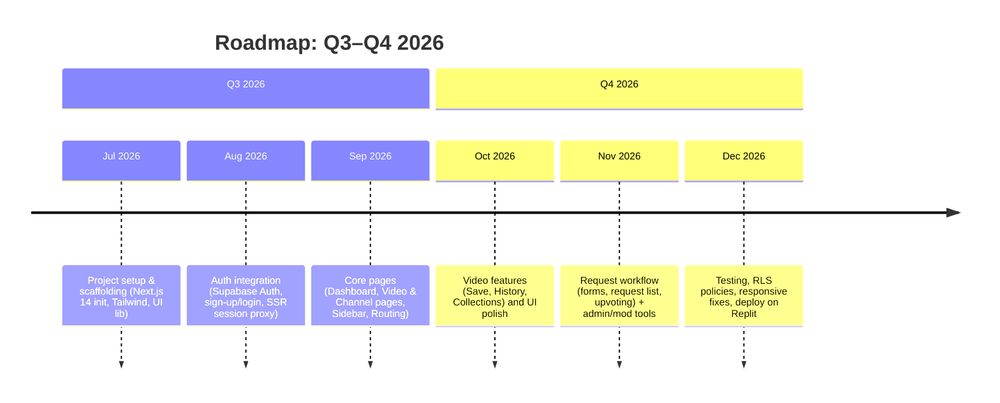

# Executive Summary  
We propose building the frontend of the video-archive site as a **Next.js 14** App Router project using **TypeScript**, **Tailwind CSS**, and a modern component library (e.g. [shadcn/ui](https://ui.shadcn.com) or similar).  The app will integrate with the existing Supabase database for data and authentication, using Supabase Auth with cookie-based sessions. We will follow official Supabase/Next.js guidance: e.g. creating separate Supabase clients for browser and server, and using `@supabase/ssr` to handle token refresh via a Next.js middleware proxy.  Key features include user sign-up/login, secure session management, and persisting user data in tables (profiles, saved_videos, recording_requests, etc.) with Row Level Security enabled so each user only sees their own records.  

Below we detail the tech stack, architecture, UI/UX flows, and deliverables. We provide (1) a concise Replit prompt (to scaffold the frontend) that incorporates all requirements; (2) a PRD-style checklist of features and acceptance criteria; (3) a table mapping frontend features to Supabase tables/columns (with assumptions marked); (4) a high-level timeline (Mermaid); and (5) prioritized next steps. 

## Technology Stack & Architecture  
- **Framework**: Next.js 14 App Router. This provides a file-based routing and layout system with React Server Components and stable [Server Actions] for forms. (Server Actions allow handling form submissions on the server without separate API routes, which can simplify the recording request workflow.)  
- **Language**: TypeScript, for static typing and safety.  
- **Styling/UI**: Tailwind CSS for utility-first styling, plus a component library like **shadcn/ui**. For example, shadcn/ui (built on Radix UI and Tailwind) offers prebuilt components (Cards, Buttons, Avatars, etc.).  (The official Supabase/Next.js starter uses shadcn/ui by default, but alternatives like DaisyUI or Flowbite could be considered if preferred.)  
- **Auth/Backend**: Supabase (existing project). We will use **Supabase Auth** (email/password or magic link as configured) for user sign-up and login. Sessions will be stored in cookies (via `@supabase/ssr`) so that both client and server code can check auth status. For server-side data fetching, we follow Supabase’s SSR guide: create one client for browser (using `createBrowserClient` from `@supabase/ssr`) and one for server (using Node JS supabase client), with a Next.js middleware (“Proxy”) that refreshes tokens in cookies.  
- **Data Security**: All user-specific tables will enable **Row Level Security (RLS)**.  By default Supabase enables RLS on new tables, and we will write policies to restrict data to the owning user. For example, we will include a `user_id UUID` column (referencing `auth.users`) on tables like `profiles`, `saved_videos`, etc., and a policy using `auth.uid() = user_id`. This ensures each logged-in user sees only their records. (Supabase docs explicitly describe using `auth.uid()` in WHERE clauses to enforce this.)  

## Supabase Integration and Data Model  
We will use our **existing Supabase project** (not a new one). Environment variables `NEXT_PUBLIC_SUPABASE_URL` and `NEXT_PUBLIC_SUPABASE_PUBLISHABLE_KEY` will be set from that project. We should run the Supabase CLI to link and sync the schema:  
```bash
supabase link --project-ref <project-id>
supabase db pull
```  
This pulls down the current table definitions to our local project.  We will then map out the key tables (many we assume or create if missing):  

- **profiles**: stores user profile info (e.g. `user_id UUID references auth.users`, `display_name`, `avatar_url`, etc.). RLS policy: `auth.uid() = user_id`.  
- **videos**: lists archived videos (e.g. `id UUID`, `url`, `title`, `channel_id`, `created_at`, etc.).  
- **saved_videos**: many-to-many linking users to videos (`user_id`, `video_id`, `saved_at`). RLS: user sees only own saves (WHERE user_id = auth.uid()).  
- **watch_history**: records user views (`user_id`, `video_id`, `watched_at`, `progress`).  
- **channel_follows**: tracks channel subscriptions (`user_id`, `channel_id`, `followed_at`).  
- **recording_requests**: stores user requests for channel recordings (`id`, `user_id`, `channel_id`, `status`, `notes`, `created_at`).  
- **request_votes**: upvotes on requests (`user_id`, `request_id`).  
- **collections**: user-defined video collections (`id`, `user_id`, `name`, `created_at`).  
- **collection_items**: links collections to videos (`collection_id`, `video_id`).  
- **notifications**: notifications for a user (`id`, `user_id`, `type`, `message`, `related_id`, `is_read`, `created_at`).  
- **comments** *(optional)*: if comments are supported (`id`, `user_id`, `video_id`, `content`, `created_at`).  
- **reports**: content/user reports (`id`, `user_id`, `target_type`, `target_id`, `reason`, `created_at`).  
- **user_roles**: role assignments (`user_id`, `role` = enum(`user`,`moderator`,`admin`)).  

Each user-facing table above will have a foreign-key `user_id` column (referencing `auth.users`) and an appropriate RLS policy (e.g., “SELECT * FROM saved_videos WHERE user_id = auth.uid()”). This aligns with Supabase’s recommended pattern of combining Auth with RLS. 

## User Authentication & Flows  
We will implement standard auth flows: **Sign Up**, **Login**, **Email Verification**, and **Password Reset** using Supabase Auth. Users will register with email (and password or magic link), and Supabase will send verification emails. After login, a protected layout ensures the user is authenticated; unauthenticated access redirects to the login page.  (We can use a client-side check like a `PrivateRoute` component that calls `supabase.auth.getSession()` or, preferably, use Next.js 14 middleware/server-side checking with `getClaims()` for full SSR protection.) 

Once logged in, users land on a **Dashboard**. Key user flows include:  
- **Save/Unsave Video**: Users can click a “save” or “favorite” button on a VideoCard to toggle saving it. This writes to the `saved_videos` table via Supabase client. The UI should update optimistically and show loading/success states.  
- **Watch History/Continue Watching**: Video playback pages track progress. If a user leaves and returns, they see a “Continue Watching” option. We record each view in `watch_history`.  
- **Follow Channel**: On a Channel page, an authenticated user can follow or unfollow the channel. This toggles a row in `channel_follows`. The dashboard “Followed Channels” section lists channels the user follows.  
- **Recording Requests**: On a Channel page or in Dashboard, users can submit a request form to record a specific channel. The form will be a `Server Action` in Next.js 14 (so the submission runs securely on the server). Fields: user selects or enters a channel, optional notes. The new `recording_requests` row starts with status “pending”. Users and mods can upvote requests (via `request_votes` table). Users see the status of their own requests in `/dashboard/requests`.  
- **Comments and Voting**: If enabled, users can comment on videos or vote on requests. Comments write to the `comments` table; upvotes write to `request_votes`. (These are extra “community” features, minimalistic to support the request workflow.)  
- **Reporting**: Users can report inappropriate videos or channels via a form, creating a `reports` entry.  
- **Notifications**: The app generates notifications (e.g. “Your request was accepted”) stored in `notifications`. A bell icon or similar in the UI shows new alerts.  

Each of the above actions will be protected: for example, attempting to save a video or submit a request requires `auth.uid()`, and will be done via server or server-component calls to Supabase so the RLS rules apply. Error and loading states will be shown for all async actions.

## UI and Page Structure  
We will use a **responsive layout** with typical modern patterns:  
- A top navigation bar (with logo, search, user menu, notification bell) visible everywhere.  
- On desktop, a left sidebar (Dashboard navigation tabs: Saved, History, Requests, Follows, Collections, Notifications, Settings). On mobile, a bottom nav or hamburger menu to access these.  
- Pages to implement:  
  - `/login`, `/signup`, `/forgot-password` (auth pages).  
  - `/dashboard` (overview/welcome or summary).  
  - `/dashboard/saved` (list of saved VideoCards).  
  - `/dashboard/history` (recently watched videos).  
  - `/dashboard/requests` (user’s recording requests).  
  - `/dashboard/follows` (followed channels list).  
  - `/dashboard/collections` (user’s video collections).  
  - `/dashboard/notifications` (list of notifications).  
  - `/dashboard/settings` (profile and account settings).  
  - `/video/[id]` (video detail/player page with actions: save, collection, etc.).  
  - `/channel/[id]` (channel page with follow button and request form).  
  - `/admin/*` (admin/moderator pages, only accessible by admin role, to manage content/requests).  

We will create reusable components for these UI elements. For example: `VideoCard`, `ChannelCard`, `RequestCard`, `SaveButton`, `FollowButton`, `RequestForm`, `UserMenu`, `Sidebar`, `Header`, `NotificationBell`, and `EmptyState`. Styling will use Tailwind and shadcn (e.g. `<Card>` from shadcn UI). We’ll include UI patterns like cards for video items, tabs or drawers for section navigation, modals/dialogs for forms, dropdowns for user menus, toast notifications for actions, and skeleton loaders or empty-state illustrations. Dark mode toggle and responsive breakpoints (via Tailwind) will ensure a polished, accessible UX.

## 1) Replit Prompt  
```text
Build a modern, production-ready frontend for a video-archive website using Next.js 14 App Router, TypeScript, and Tailwind CSS. Integrate with an existing Supabase project for Auth and data (use NEXT_PUBLIC_SUPABASE_URL and publishable key for connection). Use shadcn/ui (or a similar Tailwind-based component library) for UI components. 

**Main Requirements:** Create a polished, responsive user interface with dark mode support. Implement Supabase Auth (cookie-based sessions, SSR) for email/password or magic-link sign-up and login, including email verification and password reset flows. Protect all private pages: redirect unauthenticated users to /login.

**User Dashboard:** After login, show a dashboard layout. Include pages or sections for: profile overview, Saved Videos, Watch History (recent/continue watching), My Requests (recordings), Followed Channels, My Collections, Notifications, and Account Settings. On desktop use a sidebar, on mobile use a bottom or off-canvas menu.

**Video Features:** Display video items as cards (with thumbnail, title, channel). Add actions for each video: Save/Unsave, Add to Favorites/Collection, Continue Watching. Each action should update the Supabase DB tables (e.g. saved_videos, collections). Provide pages or components for listing saved videos, playlists/collections, and playback.

**Channel Features:** For each channel page, display channel info and actions: Follow/Unfollow and Request Recording. The recording request form allows selecting a channel and entering notes. On submission, insert into a `recording_requests` table (with fields: user_id, channel_id, status). Show request status and allow upvoting (increment in `request_votes`). List requests on the channel page or dashboard.

**Account System:** Implement a full account system: signup, login, logout, email verify, forgot/reset password, and a user profile. Profile settings should allow updating display name, avatar, email, and password. Build a UserRoles table or use Supabase RLS to manage roles (user, moderator, admin) and show admin-only UI (e.g. an /admin panel) when the logged-in user has role=admin.

**Database Integration (existing Supabase):** Use the existing Supabase project (do not create a new one). Read from and write to tables such as: `profiles`, `videos`, `saved_videos`, `watch_history`, `channel_follows`, `recording_requests`, `request_votes`, `collections`, `collection_items`, `notifications`, `comments`, `reports`, `user_roles`. If needed, add placeholder schema with those table names and assume columns (e.g. user_id UUID, video_id UUID, status text). Enable RLS on all tables and write policies so users can only access their own data (e.g. `WHERE auth.uid() = user_id`).

**Protected Routes & Logic:** Only allow authenticated access to /dashboard/*, /video/[id], /channel/[id], etc. Redirect otherwise. Use Supabase Auth Helpers or SSR checks (`getClaims()`) to enforce this. Wrap protected sections in a layout or component that verifies the session.

**UI Details:** Use a clean, modern dark-friendly theme. Employ shadcn/ui components like Cards, Tabs, Dialogs, Menus, Toasts, Skeleton loaders, etc.. Ensure accessibility (ARIA labels, focus styles). Validate forms (e.g. request form, login form) and show errors. Use Next.js server actions or API routes for form submissions (e.g. handle recording request form with a server action). Structure code with modular components and clear folder hierarchy. 

**Pages to Build:**  
- `/login`, `/signup`, `/forgot-password` (auth pages)  
- `/dashboard` (overview)  
- `/dashboard/saved`, `/dashboard/history`, `/dashboard/requests`, `/dashboard/follows`, `/dashboard/collections`, `/dashboard/notifications`, `/dashboard/settings`  
- `/video/[id]` (video detail/playback)  
- `/channel/[id]` (channel detail)  
- `/admin` (admin/mod panel, protected to admin role)  

**Output:** Generate a complete Next.js app scaffold with these pages and components. Use placeholders or mock data where necessary, but integrate all components with Supabase (using real table names). Provide components like VideoCard, ChannelCard, RequestCard, SaveButton, FollowButton, RequestForm, Sidebar, Header, UserMenu, NotificationBell, EmptyState, etc. Include loading and error states. Ensure role-based sections (e.g. Admin) are conditionally rendered. Keep code clean and ready for deployment on Replit.
```

## 2) PRD-Style Checklist of Deliverables  

- **Authentication:** User can sign up (email+password or magic link), verify email, log in, and log out. Password reset flow works. The auth flow uses Supabase and persists session in cookies. *Acceptance:* New users appear in `auth.users` and `profiles`; protected routes redirect to `/login` if not authenticated.  
- **Dashboard and Navigation:** After login, the Dashboard layout with sidebar/nav appears. All specified dashboard sections exist (Saved, History, Requests, Follows, Collections, Notifications, Settings). *Acceptance:* Clicking each tab shows the corresponding page; on mobile a responsive menu is present.  
- **Video Listing & Actions:** Video pages list videos (e.g. on Dashboard or channel). VideoCard component shows title, thumbnail, etc. Save/Unsave button toggles saving a video (in `saved_videos` table). *Acceptance:* Clicking “Save” adds to `saved_videos` for that user (RLS prevents other users’ data). Saved videos appear in `/dashboard/saved`. Continue Watching displays a progress bar using `watch_history`.  
- **Channel Follow & Request:** Channel page has Follow button and Recording Request form. *Acceptance:* Following a channel creates a `channel_follows` record; followed channels show in `/dashboard/follows`. The recording request form (with channel select, notes) submits and creates `recording_requests` row. Users can upvote other requests; votes in `request_votes`. Requests show in `/dashboard/requests` with correct status (pending/accepted/etc).  
- **Role-Based Access:** Three roles exist (`user`, `moderator`, `admin`). *Acceptance:* An “admin” role in `user_roles` enables access to `/admin` page. Moderator/admin can see additional controls (e.g. approve requests). Regular users do not see admin functions. RLS policies use roles (e.g. only `admin` can query all `recording_requests`).  
- **Account Settings:** The settings page allows updating profile: display name, avatar, email (trigger verification), and password. *Acceptance:* Changes update the `profiles` table and Supabase Auth correctly. Notification preferences and dark-mode toggle are stored (e.g. in `profiles`).  
- **UI/UX:** All pages use consistent styling and components. Mobile view is functional. *Acceptance:* No broken layouts; forms validate inputs; loading skeletons appear during data fetch; empty states with friendly messaging if no data. Dark mode toggle works.  
- **Error Handling:** API errors (Supabase) and invalid inputs show user-friendly messages (toasts or inline). *Acceptance:* Invalid login shows error, request form errors highlight fields, etc.  
- **Deployment:** The code is organized (e.g. `app/`, `components/`, `lib/`, etc.), uses environment variables for keys, and can be run/deployed on Replit or Vercel. *Acceptance:* Running `npm run dev` starts the app, and environment variables `.env.local` must be set for Supabase.  

## 3) Feature-to-Database Mapping  

| **Frontend Feature**               | **Supabase Table / Columns (Assumed)**                                                                                                 |
|-----------------------------------|--------------------------------------------------------------------------------------------------------------------------------------|
| **User Sign-Up / Login**          | **auth.users** (Supabase internal) for credentials; <br>**profiles**: `id (UUID, PK)`, `user_id UUID references auth.users`, `display_name`, `avatar_url`, etc. *RLS:* `auth.uid() = user_id`. |
| **Profile & Account Settings**    | **profiles** table (same as above); update `display_name`, `email_verified`, `preferences`.                                        |
| **List Videos / Video Page**      | **videos**: `id`, `title`, `channel_id`, `url`, `thumbnail`, `duration`, `created_at`, etc.                                         |
| **Save/Unsave Video**            | **saved_videos**: `id`, `user_id UUID`, `video_id UUID`, `saved_at`. *RLS:* `WHERE user_id = auth.uid()`.                           |
| **Watch History (Continue)**      | **watch_history**: `id`, `user_id`, `video_id`, `watched_at`, `progress`. *RLS:* `user_id = auth.uid()`.                            |
| **Follow Channel**               | **channel_follows**: `id`, `user_id`, `channel_id`, `followed_at`. *RLS:* `user_id = auth.uid()`.                                    |
| **Request Recording (Create)**    | **recording_requests**: `id`, `user_id`, `channel_id`, `status` (enum: pending/accepted/etc), `notes`, `created_at`. *RLS:* `user_id = auth.uid()`. |
| **Upvote Recording Request**      | **request_votes**: `id`, `user_id`, `request_id`. Each user can vote once per request. *RLS:* allow only own votes.              |
| **Collections (lists)**           | **collections**: `id`, `user_id`, `name`, `created_at`. *RLS:* `user_id = auth.uid()`.                                            |
| **Collection Items**              | **collection_items**: `collection_id`, `video_id`. (FK to collections/videos.)                                                   |
| **Notifications**                | **notifications**: `id`, `user_id`, `type`, `message`, `related_id`, `is_read`, `created_at`. *RLS:* `user_id = auth.uid()`.       |
| **Comments (if used)**            | **comments**: `id`, `user_id`, `video_id`, `content`, `created_at`. *RLS:* `user_id = auth.uid()` and allow fetching comments by video. |
| **Reports (moderation)**          | **reports**: `id`, `user_id`, `target_type` (video/channel), `target_id`, `reason`, `created_at`. *RLS:* `user_id = auth.uid()`.     |
| **User Roles**                  | **user_roles**: `user_id UUID`, `role` (enum: `user`/`moderator`/`admin`). Map auth.users to roles.                               |

*Notes:* Columns above are illustrative; actual schema may vary. All tables above should have RLS policies (e.g. `USING auth.uid() = user_id`) so each user can only select/modify their own rows. Tables like `videos` (if public) may allow all users to select. Some tables (e.g. `recording_requests`) may have additional policies: e.g. allow moderators to update status.

## 4) Implementation Timeline (Mermaid)  


## 5) Prioritized Next Steps  
1. **Clarify Data & Requirements:** Confirm existing Supabase schema details (table/column names) and Supabase Auth settings (email vs magic-link). Decide on component library (e.g. finalize shadcn/ui). Gather any branding colors or fonts.  
2. **Supabase CLI Setup:** Install the Supabase CLI, run `supabase link --project-ref <id>` and `supabase db pull` to sync the schema locally. Examine tables (add missing ones with `ALTER TABLE ...` and enable RLS). Create any needed placeholder tables (`videos`, `recording_requests`, etc.) in the DB.  
3. **Initialize Project:** Use `npx create-next-app@latest` with `--typescript` to start a new Next.js 14 app. Configure Tailwind CSS and install shadcn/ui (or chosen library). Add `@supabase/supabase-js` and `@supabase/ssr`. Create Supabase client utilities (`lib/supabase/client.ts` and `server.ts`) as per docs. Set up environment vars (`.env.local`).  
4. **Implement Auth Pages:** Build `/signup`, `/login`, `/forgot-password` using Supabase Auth helpers. On signup, insert a row into `profiles`. Implement email verification and password reset via Supabase functions. Protect `/dashboard/*` with a layout or guard that checks the Supabase session (e.g. using `supabase.auth.getSession()` on the server or `getClaims()`).  
5. **Build Main UI and Components:** Create the Dashboard layout with sidebar or mobile nav. Develop reusable components: `VideoCard`, `ChannelCard`, `SaveButton`, etc. Statically design pages (Dashboard empty state, Video/[id], Channel/[id], Settings). Use skeleton loaders for data fetching states.  
6. **Connect Data Actions:** Wire up interactive features: saving videos (`saved_videos` table), following channels (`channel_follows`), watch history, and profile updates. Use Supabase client calls (via server actions or client components) to read/write data. Ensure RLS policies return correct data.  
7. **Recording Requests and Community:** Implement the recording request form (use a server action to insert into `recording_requests`). Build pages to list requests and vote. Add tables and API calls for `request_votes` and comments if needed.  
8. **Roles & Admin:** Set up the `user_roles` table. Show/hide admin UI based on role. Create `/admin` pages for moderators (e.g. to approve/reject requests). Enforce RLS: only admins can view all requests.  
9. **Finalize & Test:** Thoroughly test each flow (mobile/desktop). Validate RLS by logging in as different users. Write form validations. Address any CORS or deployment issues (Replit requires certain build settings). Perform accessibility checks (ARIA attributes, color contrast). Then deploy and verify everything works end-to-end.  

**Sources:** We based this plan on official Next.js and Supabase docs and best practices. For example, the Supabase + Next.js starter template uses similar tech (cookie-based Auth, TypeScript, Tailwind, shadcn/ui). The Supabase guides emphasize RLS for user data security and show how to configure SSR auth in Next.js. We also referenced Next.js 14 features like Server Actions and the shadcn/ui component library examples. The output prompt and timeline reflect these modern patterns and integration steps.